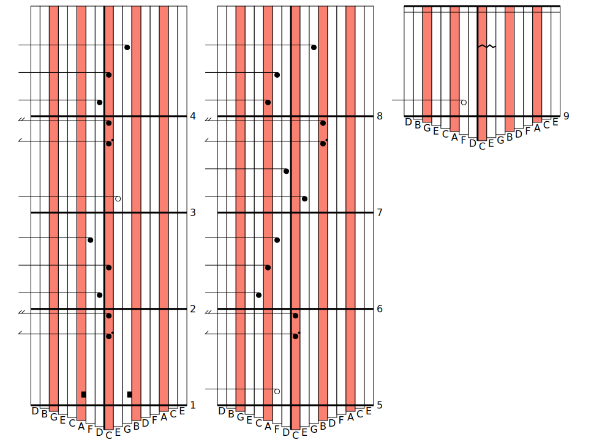

# kablature

Commandline tool to assist creating Kalimba tablatures.


- Happy Birthday

## Compiling

Kablature requires Quicklisp to compile. While it tries to be portable
with other implementations, it assumes SBCL as its compiler, and I'm
making no personal effort to test it on other implementations for the
time being.

Compiling with Make:

```bash
$ make
$ make examples # compile all example tab files.
$ sudo make install
```

Compiling with Common Lisp (SBCL):

```lisp
* (load "kablature.asd") # or move it to ~/quicklisp/local-projects
* (ql:quickload :kablature)
* (asdf:make :kablature) # Build the program in the project root.
```

## Commandline Interface

```
Convert a tablature file into a visual SVG.

Usage: ./kablature [-h|--help] [-o|--output OUTPUT] [-b|--bars BARS] FILE

Available options:
  -h, --help               Print this help text
  -o, --output OUTPUT      Place output into OUTPUT (default standard output)
  -b, --bars BARS          Force the tablature output to a specific number of bars per staff.

If FILE is not provided, kablature reads from standard input.
```

## File Format Anatomy

A tablature file is a symbolic expression, like Lisp:

```lisp
(deftablature "Happy Birthday" (:timesig (3 . 4) :keys 17)
  (2 nil) (8 t 1) (16 nil 1)

  (4 nil 2) (4 nil 1) (4 nil 4)
  (2 nil 3) (8 t 1) (16 nil 1)
  (4 nil 2) (4 nil 1) (4 nil 5)
  (2 nil 4) (8 t 1) (16 nil 1)

  (4 nil 8) (4 nil 6) (4 nil 4)
  (4 nil 3) (4 nil 2) (8 t 7) (16 nil 7)
  (4 nil 6) (4 nil 4) (4 nil 5)
  (2 nil 4) (4 nil))
```

The first argument is the name of the song (currently not used, but is
planned to be printed at the top of the file).

The second argument is a property list of the following optional
values:

    - `:timesig (beats-per-bar . beat-root)` - A time signature of 4/4
    and 3/4 would look like `:timesig (4 . 4)` and `:timesig (3 . 4)`,
    respectively. The default is a 4/4 time signature.
    - `:keys KEYS`. The number of keys that the kalimba tablature will
    have. The default is 17, the number of keys on my own kalimba.
    - `:bars-per-staff`. The program will automatically split the
    tablature into multiple staves as best as they can, but you can
    force it to a specific number of beats per staff. Any non-postive
    integer will force the tablature into a single staff.
    
Within the body of the expression, there are two types of structures:
chords and beamed groups.

Chords follow the syntax `(note-type dotted? keys...)`. `note-type`
can be of 1,2,4,8, and 16 to describe that it's a whole, half, quarter
note etc. `dotted?` is a boolean `t`/`nil` value describing whether
it's a dotted note. `keys` can be a list of integers from `1` to the
number of keys on the tablature, describing which keys that the note
plays. 

For example, `(4 nil 1)` describes a quarter note that plays the first
key on the kalimba. `(8 t 1 3 5)` describes a dotted eighth note that
plays keys 1, 3, and 5 together. `(2 nil)` describes a half note that
plays no keys -- implicitly, a rest.

Beamed groups follow the syntax `(beamed ....)`, where `beamed` is the
literal symbol `beamed`. Chords can only be non-rest eighth and
sixteenth notes, and describes that the notes are grouped together by
a beam instead of lonely flags for each note.

For example, while `(8 nil 1) (8 nil 3)` describes two lonely eighth
notes and draws the flags for each indivdual chord, `(beamed (8 nil 1)
(8 nil 3))` describes the same two chords grouped together by a single
beam.

## License

BSD 3-Clause

